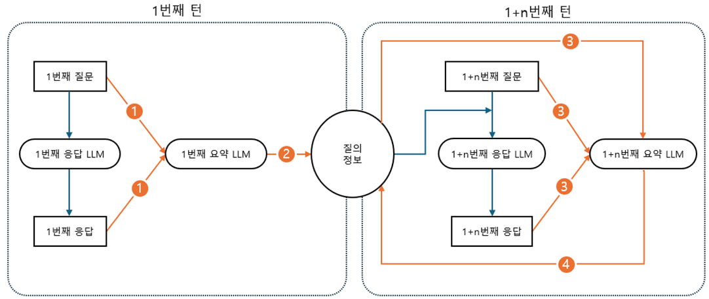

LLM 기반 의료정보 챗봇을 개발하며 얻은 다양한 경험과 노하우를 공유하고자 합니다. 성능 최적화, 신뢰성 확보, 개인화 및 문맥 관리, 평가 및 피드백 등 여러 측면에서 접근했으며, 특히 '프롬프트 엔지니어링', '개인화 데이터 연동', '테스트 데이터 구성'에 초점을 맞추어 실제 개발 과정에서 경험한 내용을 중심으로 설명하겠습니다.
<!--more-->
- **성능 최적화**
    - 도메인 특화 파인튜닝을 통한 전문성 강화
    - 특정 태스크에 대한 맞춤형 학습 (표 생, 보고서 생성 등)
- **신뢰성 확보**
    - RAG(Retrieval-Augmented Generation) 구현으로 답변의 출처 및 참고자료 명시
- **개인화 및 문맥 관리**
    - 사용자 DB 연동을 통한 개인 맞춤형 답변 제공
    - 프롬프트 엔지니어링을 통한 일관된 출력 포맷 구현
    - 대화 히스토리 관리를 통한 문맥 유지
- **평가 및 피드백**
    - 체계적인 테스트 데이터 구성
    - 휴먼 평가를 통한 성능 검증

## 1. 프롬프트 엔지니어링

### 1.1 CoT(Chain of Thought)와 Few-shot 설계

프롬프트는 크게 **CoT(Chain of Thought)**와 **Few-shot** 두 영역으로 구성했습니다. 이 방식을 통해 복잡한 질문도 단계적으로 분석하여 정확한 응답을 생성할 수 있었습니다.

### CoT 구성 (6단계)

1. **환자 기본 정보 확인**: 접속한 보호자에 해당하는 환자 정보 로드
2. **진료 정보 확인**: 환자의 진료 기록 데이터 참조
3. **질문 분석**: 보호자(챗봇 사용자)의 의도 파악
4. **관련 데이터 추출**: 질문에 맞는 데이터 필터링
5. **데이터 해석**: 필요한 계산이나 정리 수행
6. **결론 도출**: 자연어 형태의 답변 생성

CoT 프롬프트를 설계할 때 핵심은 **모델이 단계적으로 추론할 수 있도록 유도**하는 것입니다. 

예를 들어, "최근 처방받은 약이 뭐예요?"라는 질문에 바로 답하게 하는 것이 아니라, '최근'이라는 시간 정보를 파악하고 → 진료 기록을 시간순으로 정렬한 뒤 → 가장 최근 데이터를 찾는 과정을 명시적으로 지시했습니다.

### Few-shot 예시 활용

CoT 뒤에 3가지 사례를 통한 Few-shot 예시를 포함하여 모델의 이해를 돕고 일관된 결과를 도출할 수 있었습니다. 이 방식은 모델에게 "이런 질문이 들어오면 이렇게 답해야 해"라고 구체적인 예시를 보여주는 효과가 있습니다.

```
# Few-shot 예시 구조

질문: "최근 진료받은 날짜가 언제인가요?"

1. 정보 확인:
   - 환자: 홍길동
   - 진료 기록: [2024-09-15, 2024-10-02, ...]

2. 관련 데이터 추출:
   - 진료 날짜를 시간순으로 정렬: [...]
   - 가장 최근 진료일: 2024-10-02

3. 데이터 해석:
   - 최근 진료일은 2024년 10월 2일임

4. 결론:
   "2024년 10월 2일 오후 3시입니다."
```

### 1.2 프롬프트 최적화 팁

프로젝트를 진행하며 경험한 성능향상을 위한 프롬프트 방법은 다음과 같습니다.

- **DB 컬럼명 변환**: RDB의 컬럼명을 그대로 사용하지 않고 LLM이 이해하기 쉬운 자연어 형태로 변환하여 제공했을 때 성능이 크게 향상되었습니다 (RDB에서 들어오는 컬럼명이 "contents", "request_disease", "disease_name" 과 같이 들어왔을때 LLM이 답변 시 헷갈리는 경우가 생겨서 , "환자가 언급한 증상", "환자가 의뢰한 병명", "진단된 질환명",  과 같이 LLM이 더 이해하기 쉬운 형태로 변환하여 제공하였음)
- **명확한 지시사항**: 애매한 표현보다는 "~를 나열하세요", "~를 계산하세요"와 같은 명확한 지시어를 사용했을 때 일관된 결과를 얻을 수 있었습니다
- **제한사항 명시**: "해당 환자의 정보만 제공하세요", "추측하지 마세요" 등의 제한사항을 명확하게 명시하여 환각을 줄였습니다

## 2. 개인화 및 문맥 관리

### 2.1 사용자 DB 연동

개인화된 챗봇을 구현하기 위해 환자 정보를 실시간으로 참조하는 시스템을 구축했습니다.

### 데이터 연동 구조

```
👤 보호자 로그인 → 🔍 담당 환자 정보 조회 → 📊 환자 진료 기록 조회 → 💬 챗봇 응답 생성
```

보호자가 로그인하면 담당 환자 정보를 조회하고, 해당 환자의 진료 기록을 참조하여 챗봇이 응답을 생성하는 흐름으로 설계했습니다. 이러한 구조를 통해 보호자는 자신의 담당 환자에 대한 정보만 조회할 수 있어 **개인정보 보호**와 **맞춤형 응답**을 동시에 구현할 수 있었습니다.

### 데이터 구조화

```
Patient_data/
  └── [user_id]/
      └── medical_data.json
  └── [user_id]/
      └── medical_data.json
  └── [user_id]/
      └── medical_data.json
```

환자 데이터는 사용자 ID를 기준으로 분류하여 각 사용자별로 고유한 의료 데이터 JSON 파일을 생성하는 계층 구조로 조직화했습니다. 각 파일에는 다음과 같은 정보가 포함됩니다.

- **환자 기본 정보**: 생년월일, 성별, 키, 체중, 기저질환 등 인적 사항
- **최근 건강 상태**: 혈압, 맥박, 호흡, 체온, 혈당 등 건강 지표
- **의료 기관 정보**: 환자가 방문한 병원과 약국 정보
- **진료 기록**: 과거 진료 내역과 처방 받은 약물 정보
- **예약 정보**: 미래 진료 예약 일정

### 데이터 전처리

데이터 전처리 과정에서는 다음과 같은 작업들을 수행했습니다.

- **날짜 정보 변환**: 문자열 형태의 날짜를 datetime 객체로 변환하여 시간 비교와 정렬이 가능하도록 처리했으며, 빠른 처리를 위해 캐싱 기법을 적용했습니다
- **약품 정보 정제**: 약품명에서 단위 정보를 자동으로 추출하고, 불필요한 코드나 부가 정보를 제거하여 사용자가 이해하기 쉬운 형태로 정제했습니다
- **누락 데이터 처리**: 정보가 없는 경우 기본값을 설정하고, 예외 상황에 대한 처리 로직을 구현하여 시스템 안정성을 높였습니다

### 2.2 세션 기반 대화 관리

대화 문맥을 유지하기 위해 세션별로 독립적으로 질의정보를 저장하고 사용하는 세션 관리 시스템을 구현했습니다. 이 시스템은 다음과 같은 방식으로 작동합니다.

1. **대화 저장 방식**: 각 사용자(User_id)와 세션별(Session_id)로 고유한 JSON 파일을 생성하여 대화 내용을 저장합니다. 이 파일은 사용자 ID와 세션 ID를 조합하여 고유한 경로에 저장됩니다.
2. **대화 요약 자동화**: 대화가 길어질수록 컨텍스트 크기가 커지는 문제를 해결하기 위해, 각 대화가 끝날 때마다 전체 대화 내용을 자동으로 요약합니다. 이 요약본은 다음 대화에서 LLM에게 전달되어 이전 대화의 맥락을 이해할 수 있게 합니다.
3. **요약 관리 프로세스**
    - 사용자의 질문과 챗봇의 응답이 완료되면, 이전 요약본과 새로운 대화를 합쳐서 LLM에게 전체 대화를 다시 요약하도록 요청합니다
    - 새로 생성된 요약본은 다음 차례의 대화를 위해 저장됩니다
    - 이런 방식으로 대화가 길어져도 중요한 맥락은 유지하면서 컨텍스트 크기를 관리할 수 있습니다
    
    <div style="text-align: center">
        
    </div>
    
4. **비동기 처리**: 모든 파일 읽기/쓰기 작업은 비동기 방식으로 처리하여 사용자 응답 시간을 최소화했습니다. 특히 비동기 파일 처리 라이브러리를 활용하여 파일 I/O가 응답 속도에 영향을 미치지 않도록 했습니다.

이 방식을 통해 다음과 같은 이점을 얻을 수 있었습니다.

- **연속적 대화 지원**: 이전 대화 내용을 기억하여 맥락에 맞는 답변 제공
- **효율적인 메모리 관리**: 전체 대화 내역을 그대로 유지하는 대신 요약본을 활용하여 컨텍스트 크기를 관리
- **개인화된 경험**: 사용자별로 대화 기록을 분리하여 개인화된 경험 제공
- **시스템 안정성**: 비동기 처리를 통한 성능 최적화로 시스템 안정성 향상

## 3. 테스트 데이터 구성

### 3.1 주제 분석 및 데이터 생성

체계적인 테스트를 위해 주제 분석(Topic Analysis)을 통한 평가 데이터를 구성했습니다. 신뢰할 수 있는 챗봇 평가를 위해서는 실제 사용자들이 묻는 질문 패턴과 유형을 포괄하는 테스트 데이터가 필수적이었습니다.

### 데이터 수집 및 분석 방법론

1. **대규모 데이터 수집**:
    - 의료 및 건강 관련 유튜브 채널을 대상으로 데이터를 수집했습니다
    - 구독자 수 기준으로 영향력 있는 의사 채널 500개를 선별한 후, 채널명과 소개글을 검토하여 의사 관련 채널 111개와 약사 관련 채널 91개를 최종 분석 대상으로 선정했습니다
    - 이들 채널에서 게시된 영상 제목 20,105개를 수집하여 주제 분석의 기초 데이터로 활용했습니다
2. **단계적 주제 분류 프로세스**:
    - **1단계 - 자동화 분석**: LDA(Latent Dirichlet Allocation) 기법을 활용하여 대량의 데이터에서 주요 키워드와 잠재적 주제를 추출했습니다
    - **2단계 - 전문가 1차 검증**: 텍스트 분석 전문가가 의미 없는 키워드를 제거하고 추출된 키워드를 주제별로 분류했습니다. 특히 5년 이상 인사이트 도출 경험이 있는 분석가가 참여하여 전문성을 확보했습니다
    - **3단계 - 전문가 2차 검증**: 의학 분야 박사, 전문 보호인력, 비대면 진료 서비스 기획자로 구성된 전문가 그룹의 검토를 통해 주제 분류를 최종 확정했습니다

### 주제 분류 체계

주제는 크게 두 가지 영역으로 나누었습니다.

1. **관계형 데이터베이스 내용에 대한 질문 영역**: 환자의 실제 진료 정보에 대한 질문
2. **관계형 데이터베이스 내용을 활용한 의학 기본정보 질문 영역**: 환자 정보를 바탕으로 한 일반적 의학 지식 질문

이를 바탕으로 5가지 상위 주제를 설정했습니다.

### 5가지 상위 주제 분류

| 상위 주제 | 설명 | 하위 주제 예시 |
| --- | --- | --- |
| 진료 정보 | 환자의 진료 관련 정보 | 진료 일정, 진단 결과, 의사 소견 |
| 환자 정보 | 환자의 기본 정보 | 인적사항, 알레르기, 기저질환 |
| 처방 정보 | 약물 처방 관련 정보 | 처방약, 복용법, 주의사항 |
| 건강 정보 | 일반적인 건강 정보 | 증상 관리, 건강 조언 |
| 복약 상담 | 약물 복용 관련 정보 | 약물 간 상호작용, 부작용 |

이러한 체계적인 주제 분류를 바탕으로 467개의 평가 데이터를 생성했으며, 각 질문은 실제 보호자들이 자주 물어볼 법한 내용으로 구성했습니다.

전체 데이터셋은 https://huggingface.co/datasets/theimc/Chatbot_data_patient 에서 확인할 수 있습니다.

### 3.2 평가 데이터 생성 및 검증

주제 분류 프레임워크를 기반으로 실제 평가에 사용할 질문 데이터를 다음과 같이 생성했습니다.

1. **질문 생성 방법론**
    - 각 주제별로 전문 평가 기관에 의뢰하여 실제 사용자의 질문 패턴을 반영한 테스트 질문 생성
    - 6개의 대표적인 질병 케이스를 설정하고, 각 질병별로 주제를 고르게 분포시킨 질문 구성
    - 질문의 복잡성을 다양하게 설정하여 단순 사실 확인부터 복합적 판단이 필요한 질문까지 포함
2. **평가 데이터 구성**
    - 최종적으로 467개의 평가 데이터를 구성했으며, 각 주제별로 균등하게 분포되도록 설계
    - 일부 질문에는 의도적으로 모호함을 포함시켜 챗봇의 분별력 테스트
3. **데이터 검증 프로세스**
    - 생성된 평가 데이터는 의료 전문가의 검토를 통해 임상적 정확성 확인
    - 실제 보호자들을 대상으로 사전 테스트를 실시하여 질문의 자연스러움과 현실성 검증
    - 질병별, 주제별 분포 분석을 통해 데이터 균형 확인

### 3.3 평가 방법 및 결과

생성된 테스트 데이터를 바탕으로 체계적인 평가를 진행했습니다.

### 평가 프로세스

1. **평가 기준 설정**
    - **응답 속도**: 15초 이내 (목표)
    - **정확도**: 80% 이상 (목표)
    - **평가 방식**: 전문가의 휴먼 평가 (pass/fail 방식)
2. **휴먼 평가 방법**
    - AI 전문 심사원, 의료 분야 전문가들이 각 응답을 검토하여 정확성 평가
    - 단순 사실 관계 확인뿐만 아니라 의학적 타당성도 함께 평가

### 테스트 결과

총 2일간의 평가 과정을 거쳐 다음과 같은 결과를 얻었습니다.

| 평가 항목 | 목표 기준 | 테스트 결과 |
| --- | --- | --- |
| 응답 속도 | 15초 이내 | 평균 13.8초 |
| 정확도 | 80% 이상 | 89.3% |
| 평가 데이터 수 | 467개 | 467개 |

### 성능 분석

주제별, 질병별 정확도를 분석한 결과, 다음과 같은 특성을 발견했습니다.

- **주제별 정확도**: 진료 정보(92.1%)와 환자 정보(94.3%) 관련 질문에서 가장 높은 정확도를 보였으며, 복약 상담(83.7%)에서 상대적으로 낮은 정확도를 보였습니다.
- **난이도별 정확도**: 단순 사실 확인 질문(95.2%)에 비해 추론이 필요한 질문(82.1%)에서 정확도가 다소 낮았습니다.
- **오답 패턴 분석**: 오답의 주요 원인은 복합적 조건이 포함된 질문에 대한 이해 부족(38%), 시간 관계 해석 오류(27%), 처방 정보 누락(21%) 등으로 분석되었습니다.

## 4. 결론

개발 과정에서 가장 중요했던 점은 단순히 기술적 구현을 넘어 **사용자의 실제 필요**에 초점을 맞추는 것이었습니다. 의료 도메인에서는 정확성과 신뢰성이 무엇보다 중요하기 때문에, 체계적인 프롬프트 설계와 철저한 테스트 데이터 구성이 개발의 핵심 요소라 생각됩니다.
